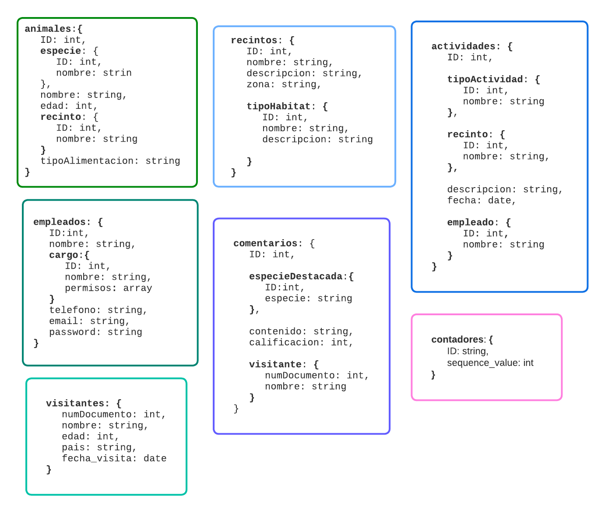
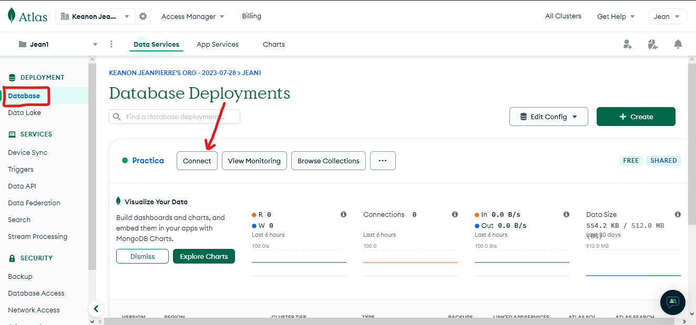
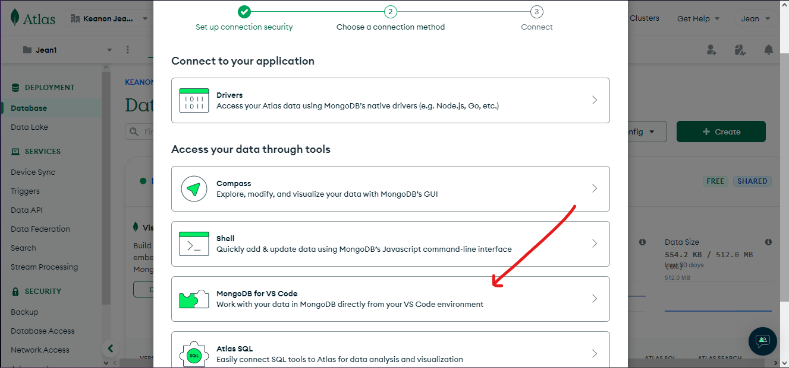
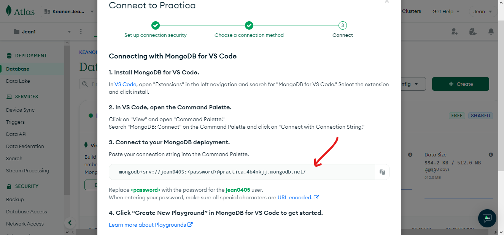
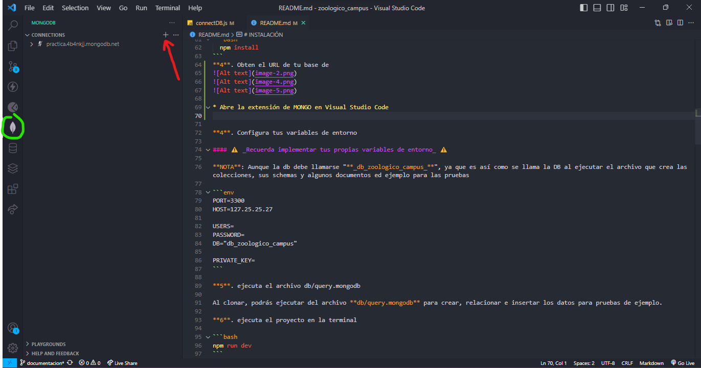
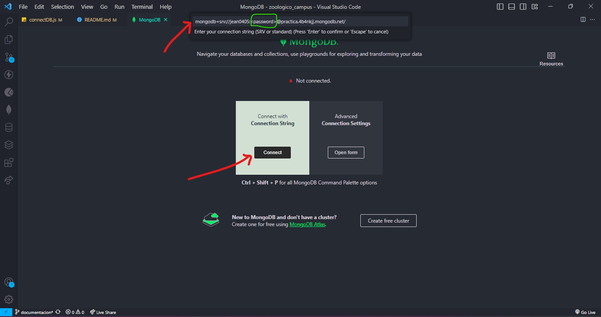
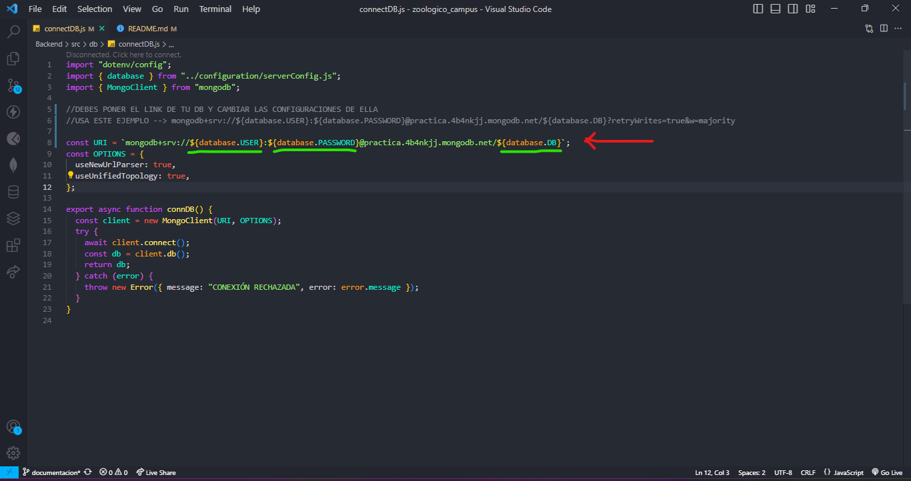
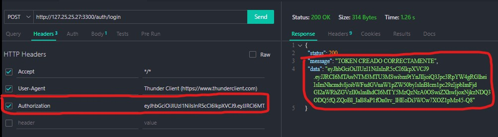

# ZOOLOGICO CAMPUSLANDS

- [Introducción](#introducción)
- [Funcionamiento de un Zoológico](#funcionamiento-de-un-zoológico)
- [Diagrama de la Base de Datos](#diagrama-de-la-base-de-datos)
- [Requerimientos](#requerimientos)
- [Instalación](#instalación)
  - [Clonar el Repositorio](#clonar-el-repositorio)
  - [Instalar Dependencias](#instalar-dependencias)
  - [Configurar Variables de Entorno](#configurar-variables-de-entorno)
  - [Cargar Datos de Ejemplo](#cargar-datos-de-ejemplo)
  - [Ejecutar el Proyecto](#ejecutar-el-proyecto)
- [Indicaciones](#indicaciones)
  - [Inicio de Sesión y Registro](#inicio-de-sesión-y-registro)
  - [Tokens](#tokens)
  - [Permisos](#permisos)
- [Endpoints](#endpoints)
  - [Login Endpoint](#login-endpoint)
  - [Animales Endpoints](#animales-endpoints)
  - [Actividades Endpoints](#actividades-endpoints)
  - [Empleados Endpoints](#empleados-endpoints)
  - [Comentarios Endpoints](#comentarios-endpoints)
- [Lenguajes a utilizar](#lenguajes-a-utilizar)


Un zoológico es un lugar donde animales salvajes de forma dividida por recintos. El proposito general de estos es educar a la población, dar el espacio para esparcimiento del público, estudiar y/o preservar las especies.

# ¿Cómo funciona un Zoo?

La mayoria de estos funcionan por medio de **microambientes** que hacen de imitaciones del hábitat natural de los animales.
Poseen cuidadores encargados de la alimentación, mantenimiento y atención del público. Generalmente en estos tambien se realizan eventos solicitados por visitantes usuarios del zoológico.

Diariamente en un zoologico se realiza la alimentación de los animales alojados para mantenerlos llenos de energia y presentarlos al público en buen estado, además la limpieza de dichos hábitats son indispensables para la buena salud del animal y la presentación de estos; Para esto se encuentran encargados los empleados de retirar excrementos y tenerlos en buenas condiciones.
Dentro de un zoologico tambien se busca preservar especies y realizar investicaciones con este fin, generando un mejor conocimiento del comportamiento de cada inidividuo alli encontrado. Un Zoo, debe garantizar la seguridad tanto de los animales como de los visitantes, tratando de prevenir emergencias por fugas y otros tipos de casos.
Finalmente, periodicamente se deben realizar chequeo medicos a los animales, tratamientos y hasta cirugias si estas son necesarias, allí incluso se realizan actividades de reproducción y atención medica especializada.

_Por lo tanto se busca realizar un proyecto el cual permita gestionar a los animales, su alimentacion, habitats, personal empleado, eventos y visitantes._

# DIAGRAMA DE LA BASE DE DATOS



# REQUERIMIENTOS

1. **Búsqueda y Filtros:**

   - buscar animales por su id, especie o recinto.
   - filtrar actividades por fecha, tipo o ubicación.
   - buscar empleados por su tipo, recinto o empleado.

2. **Información sobre Visitantes:**

   - registrar la información de los visitantes del zoológico.

3. **Comentarios y Calificaciones:**

   - visitantes dejen comentarios y calificaciones sobre los animales.

4. **Estadísticas y Reportes:**

   - obtener estadísticas sobre los animales más populares.

5. **Reservas de Eventos:**

   - Zoológico registrar actividades diarias del zoológico.

6. **Autenticación y Autorización:**
   - Asegurar que ciertos endpoints solo sean accesibles para empleados autorizados.

# INSTALACIÓN

**1**. Clona este repositorio en tu computadora, usa el siguiente comando:

```bash
git clone https://github.com/Jean0405/zoologico_campus.git
```

**2**. Asegurate de tener Node.js instalado en tu computadora. De no ser así, descargalo e instala [Node js](https://nodejs.org/es/download)

**3**. Instala las dependecias necesarias de forma automatica con el siguiente comando, el cual tomara el archivo **package.json** y lo tomara de guía para dichas instalaciones.

```bash
  npm install
```

**4**. Obten el URL de tu base de




- Abre la extensión de MONGO en Visual Studio Code y dale al '+' para agregar una nueva conexión.



- Da en **Connect** para poder pegar tu URL, donde deberás poner la **contraseña** de tu MongoDB



- Reemplaza este link por el **tuyo**, y pon las **variables de entorno** donde corresponde según la imagen de ejemplo



**5**. Configura tus variables de entorno

#### ⚠️ _Recuerda implementar tus propias variables de entorno_ ⚠️

**NOTA**: Aunque la **DB** debe llamarse "**_db_zoologico_campus_**", ya que es así como se llama la DB al ejecutar el archivo que crea las colecciones, sus schemas y algunos documentos ed ejemplo para las pruebas

```env
PORT=3300
HOST=127.25.25.27

USERS=
PASSWORD=
DB="db_zoologico_campus"

PRIVATE_KEY=
```

**6**. ejecuta el archivo db/query.mongodb

Al clonar, podrás ejecutar del archivo **db/query.mongodb** para crear, relacionar e insertar los datos para pruebas de ejemplo.

**7**. ejecuta el proyecto en la terminal

```bash
npm run dev
```

# INDICACIONES

### 🪪 INICIO DE SESIÓN Y REGISTRO

- Los empleados deberán **iniciar sesión** para poder utilizar los endpoints relacionados al manejos y gestión interno del zoológico.

- Pero para poder iniciar sesíon, el empleado debio haber sido **ingresado** en la base de datos por algún otro empleado con el permiso correspondiente para dicha acción.

**NOTA**: Debe haber un empleado ya registrado con el permiso de **_admin_** o con permiso para **_empleados_** que es la seccíon donde se registran los nuevos trabajdores del zoológico en la DB.

### 🎫 TOKENS

- Cuando ya te has registrado e iniciado sesión, obtendrás un **TOKEN** el cual te permitira estar identificado por la aplicación y entrar en ella.

**NOTA**: Una vez obtienes un token debes ponerlo en el **_HEADER_** de las solicitudes, por ejemplo:

Authorization: **tu_Token_Obtenido**


### 🛂 PERMISOS

Una vez que el Admin o algun empleado con permiso para registrarte lo haya hecho y hayas INICIADO SESIÓN, el token es el que indicará si tienes acceso a cierto endpoint o no. Es decir, el token posee información a cerca de tus permisos en el zoológio.

- **[ * ]** ➡️ acceso a **todos** los endpoints, sin restricción alguna.

**_NOTA_**: Por defecto, al crearse la base de datos ya debe existir un empleado con dicho permiso.

```json
/* POR DEFECTO, EL ADMIN ES EL PRIMERO CON ESTOS PERMISOS. POR LO TANTO ES QUIEN REGISTRA EN LA DB A LOS PRIMEROS EMPLEADOS*/

// Ejemplo para LOG IN del [admin]
{
  "email": "cavillafrades@gmail.com",
  "password": "carlos123"
}
```

- **[ empleados ]** ➡️ acceso a los endpoints de **empleados**, este permite registrar a nuevos trabajadores y listar información a cerca de los mismos.

- **[ actividades ]** ➡️ accesos a los endpoints de **actividades**, los cuales permiten registrar y listar las mismas.

- **[ animales ]** ➡️ accesos a los endpoints de **animales**, los cuales permiten registrar y listar los mismos.

**_NOTA_**: tambien pueden tener varios permisos

- **[ animales, actividades]** ➡️ acceso a esos determinados endpoints

# ENDPOINTS

### 🟢LOGIN ENDPOINT

- `http://127.25.25.27:3300/auth/login` -->
  Permite iniciar sesión en el proyecto, verificando que exista en la DB y creando tu token personal.

```json
// EJEMPLO LOGIN [admin]

{
  "email": "cavillafrades@gmail.com",
  "password": "carlos123"
}
```

### 🟢ANIMALES ENDPOINTS

- **GET:** `http://127.25.25.27:3300/animales` --> Permite listar todos los animales del zoológico.
- **GET:** `http://127.25.25.27:3300/animales/recinto/:recintoID` --> Permite listar todos los animales basado en su recinto ( **_recintoID_** ).
- **GET:** `http://127.25.25.27:3300/animales/especie/:especieID` --> Permite listar todos los animales basado en su especie ( **_especieID_** ).
- **GET:** `http://127.25.25.27:3300/animales/:animalID` --> Permite listar a un animal basado en su propio ID.
- **POST:** `http://127.25.25.27:3300/animales` --> Permite crear y guardar un nuevo animal en la base de datos.

```json
// EJEMPLO ANIMALES
{
  "especie": {
    "ID": 2,
    "nombre": "delfines"
  },
  "edad": 10,
  "recinto": {
    "ID": 2,
    "nombre": "delfinario"
  },
  "tipoAlimentacion": "carnívoro"
}
```

### 🟢ACTIVIDADES ENDPOINTS

- **GET:** `http://127.25.25.27:3300/actividades` --> Permite listar todas las actividades registradas.
- **GET:** `http://127.25.25.27:3300/actividades/tipo/:tipoID` --> Permite todas las actividades basadas con su tipo (**_tipoID_**).
- **GET:** `http://127.25.25.27:3300/actividades/fecha/:fecha` --> Permite todas las actividades basadas en su fecha (**_fecha_**).
- **GET:** `http://127.25.25.27:3300/actividades/recinto/:recintoID` --> Permite todas las actividades basadas en el recinto donde se realizo (**_recintoID_**).
- **POST:** `http://127.25.25.27:3300/actividades` --> Permite crear y registrar una nueva actividad en la base de datos

```json
// EJEMPLO ACTIVIDADES

{
  "tipoActividad": {
    "ID": 2,
    "nombre": "show"
  },
  "recinto": {
    "ID": 2,
    "nombre": "delfinario"
  },
  "descripcion": "Se realizo un show de delfines con zardinas como premio",
  "empleado": {
    "numDocumento": 1005371555,
    "nombre": "Sara Angarita"
  }
}
```

### 🟢EMPLEADOS ENDPOINTS

- **GET:** `http://127.25.25.27:3300/empleados` --> Permite listar todas los empleados registrados del zoológico.
- **GET:** `http://127.25.25.27:3300/empleados/:empleadoID` --> Permite listar un empleado basado en su ID (**_empleadoID_**)
- **GET:** `http://127.25.25.27:3300/empleados/cargo/:cargoNombre` --> Permite listar todos los empleados basado en el nombre de su cargo en el zoológico (**_cargoNombre_**), por ejemplo: "**_cuidador_**".
- **POST:** `http://127.25.25.27:3300/empleados` --> Permite crear y registrar un nuevo empleado en el zoológico.

```json
// EJEMPLO EMPLEADOS

{
  "numDocumento": 1234567890,
  "nombre": "William Angarita",
  "cargo": {
    "nombre": "cuidador",
    "permisos": ["animales", "actividades"]
  },
  "telefono": "3124261084",
  "email": "william@gmail.com",
  "password": "williampwd"
}
```

### 🟢COMENTARIOS ENDPOINTS

- **GET:** `http://127.25.25.27:3300/comentarios` --> Permite listar todos los comentarios registrados.
- **GET:** `http://127.25.25.27:3300/comentarios/:comentarioID` --> Permite listar un comentario basado en su ID (**_comentarioID_**)
- **GET:** `http://127.25.25.27:3300/comentarios/visitante/:visitanteID` --> Permite listar un comentario basado en el visitante que lo realizo (**_visitanteID_**)
- **GET:** `http://127.25.25.27:3300/comentarios/fecha/:fecha` --> Permite listar los comentarios realizados en determinada fecha (**_fecha_**)
- **GET:** `http://127.25.25.27:3300/comentarios/populares:nDias` --> Permite listar los animales más populares en los ultimos N días (**_ndias_**)
- **POST:** `http://127.25.25.27:3300/comentarios` --> Permite crear y registrar un nuevo comentario.

```json
// EJEMPLO COMENTARIOS

{
  "especieDestacado": { "ID": 2, "nombre": "delfines" },
  "contenido": "SUPER BONITOS LOS DELFINES",
  "calificacion": 5,
  "visitante": {
    "numDocumento": 1005184201,
    "nombre": "Keanon Angarita Olarte"
  }
}
```

# LENGUAJES A UTILIZAR

- **NODE JS** - **EXPRESS** - **MONGO DB**

# AUTORES Y COLABORADORES 🧑‍🚀

- [Keanon Jeanpierre Angarita Olarte](https://github.com/Jean0405)
- [Carlos Alberto Villafrades](https://github.com/CarlosAlbertoVillafradesCAMPUS)

- [CampusLands](https://github.com/CampusLands)
